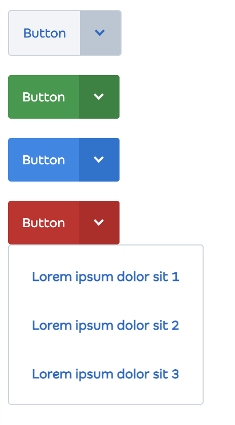

# Vue SplitDropdown

A Split Dropdown for VueJs.



## Installation

```shell
npm i https://github.com/jesse1983/jes-split-dropdown.git
```

```vue
import SplitDropdown from 'jes-split-dropdown';

<script>
export default {
  components: {
    SplitDropdown
  },
  data() {
    return {
      items: [
        { text: 'Github', href: "https://github.com", target: '_blank' }
        { text: 'Loggin', onclick: () => console.log('lorem')) }
      ];
    }
  }
}
</script>
<template>
  <split-dropdown :items="items"> My Button label </split-dropdown>
</template>
```

## Attributes

| Attribute | Type    | Description                                                                                                                                                               | Default |
|-----------|---------|---------------------------------------------------------------------------------------------------------------------------------------------------------------------------|---------|
| theme     | String  | Color theme. Available: default, primary, secondary and danger                                                                                                            | default |
| items     | Array   | A array of items: {    text: 'Label',  href: '/link', target: '_blank', onclick: () => null  } | []      |
| disabled  | Boolean | Disable all actions                                                                                                                                                       | false   |


## Development

### Requirements

- Node >= 14

```
npm install
npm run serve
```

TDD
```
npm run test:watch
```

Build
```
npm run build
```

## TODO

- Item as component `<split-dropdown-item>`
- Multiple sizes (small and large)
- Callbacks functions
- Agnostic component for any framework using WebComponent and Shadow DOM
- Menu dividers
- Dark Mode
- Popper direction
